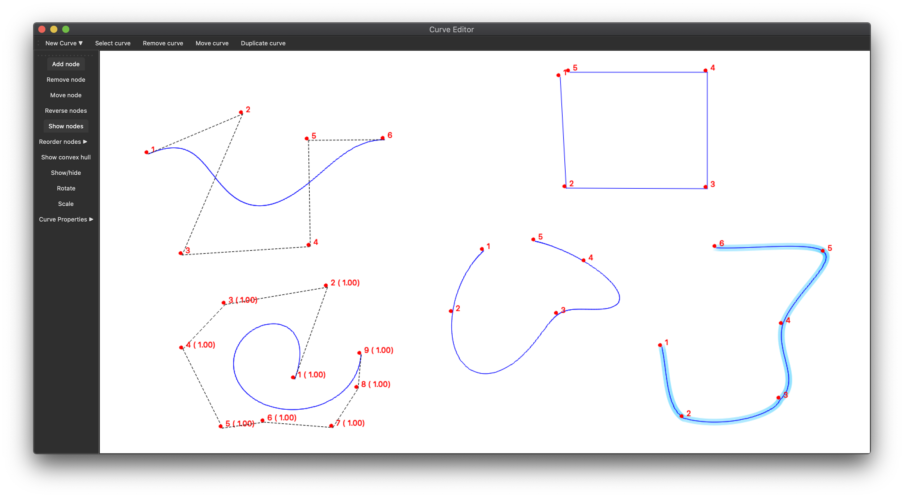

# Curve Editor
#krzywe #github #projekt

Celem projektu jest napisanie edytora krzywych

## Wymagania
###### Na ocenę 3.0 (realizacja tych funkcji daje [+3] do wyniku) konieczne jest przedstawienie projektu, w którym możliwe są:

- [x] praca na więcej niż jednej krzywej
- [x] możliwość edycji parametrów krzywej (punktów kontrolnych, wag)
	- [x] dodawanie punktów kontrolnych
	- [x] usuwanie punktów kontrolnych
	- [x] przesuwanie punktów kontrolnych
	- [x] zmiana kolejności punktów kontrolnych
		- [x] podmienianie
		- [x] wstawianie za
		- [x] wstawianie przed
	- [x] modyfikowanie wag punktów kontrolnych (wymierne krzywe Béziera)
- [x] dodanie/usunięcie krzywej
- [x] dodanie/usunięcie punktu kontrolnego
- [x] zaimplementowane są krzywe interpolacyjne
	- [x] węzły Czebyszewa
	- [x] węzły równoedległe
- [x] zaimplementowane są normalne krzywe sklejane 3 stopnia (NIFS3)
- [x] zaimplementowane są krzywe Béziera (wielomianowe i wymierne)
- [x] zaimplementowany jest schemat Hornera i algorytm De Casteljau
- [x] zaimplementowane jest podnoszenie stopnia krzywej Béziera
- [x] zaimplementowana jest jedna metoda obniżania stopnia krzywej Béziera
- [x] zaimplementowany jest podział krzywej Béziera w zadanym punkcie
- [x] zaimplementowany jest jeden rodzaj łączenia krzywych Béziera (typu C1 lub G1)

###### Ocenę podwyższamy poprzez realizację następujących zadań:

- [x] [+0.3] dodanie obowiązkowych algorytmów również dla wymiernych krzywych Béziera
	- [x] zaimplementowany jest schemat Hornera i algorytm De Casteljau
	- [x] zaimplementowane jest podnoszenie stopnia krzywej Béziera
	- [x] zaimplementowana jest jedna metoda obniżania stopnia krzywej Béziera
	- [x] zaimplementowany jest podział krzywej Béziera w zadanym punkcie
	- [x] zaimplementowany jest jeden rodzaj łączenia krzywych Béziera (typu C1 lub G1)
- [x] [+0.15] operacje na krzywych: skaluj_przesuń_obróć
- [ ] [+0.2] zaimplementowanie okresowych funkcji sklejanych 3 stopnia (OIFS3)
- [x] [+0.2] pokazywanie (na życzenie) otoczki wypukłej punktów kontrolnych danej krzywej
- [x] [+0.2] łączenie krzywych Béziera typu G1 i C1 (czyli rozszerzenie ostatniego punktu części na 3.0)
- [ ] [+0.2] zaimplementowanie drugiej techniki obniżania stopnia krzywej Béziera
- [ ] [+0.3] zaimplementowanie trzeciej techniki obniżania stopnia krzywej Béziera
- [x] [+0.05] zmiana koloru krzywej
- [x] [+0.05] zmiana grubości krzywej
- [x] [+0.05] funkcja pokaż_ukryj krzywą_punkty kontrolne
- [x] [+0.05] zmiana koloru/wielkości punktów kontrolnych
- [x] [+0.15] odwróć kolejność punktów kontrolnych danej krzywej
- [x] [+0.1] eksport rysowanej scenki do obrazka
- [x] [+0.15] eksport rysowanej scenki do pliku
- [x] [+0.15] import rysowanej scenki z pliku

### Materiały
* [Sci-Hub | Algorithms for rational Bézier curves. Computer-Aided Design, 15(2), 73–77 | 10.1016/0010-4485(83)90171-9](https://sci-hub.tw/https://doi.org/10.1016/0010-4485(83)90171-9)
* [NURBS for Curve & Surface Design: From Projective Geometry to Practical Use - Gerald Farin - Google Ksi±żki](https://books.google.pl/books?id=v8O2DwAAQBAJ&pg=PA116&lpg=PA116&dq=rational+bezier+curve+raise+degree&source=bl&ots=jfdSqv7f8u&sig=ACfU3U2so4_uTsIJuARoafssKKoQsKo2sg&hl=pl&sa=X&ved=2ahUKEwiS88ar9_DpAhVmxIsKHeNCC5UQ6AEwC3oECAkQAQ#v=onepage&q=rational%20bezier%20curve%20raise%20degree&f=false)
* [Sci-Hub | Least squares degree reduction of Bézier curves. Computer-Aided Design, 27(11), 845–851 | 10.1016/0010-4485(95)00008-9](https://sci-hub.tw/https://doi.org/10.1016/0010-4485(95)00008-9)
* [A Primer on Bézier Curves](https://pomax.github.io/bezierinfo/)